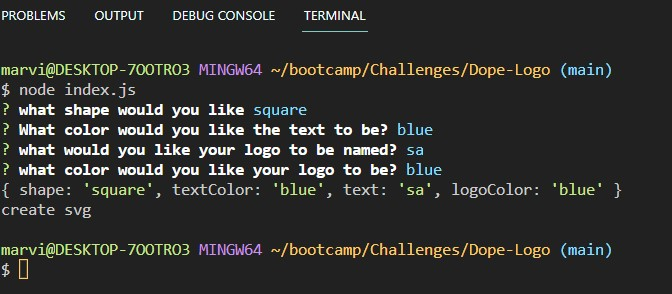

# Logo-Generator
  
## Description
In challenge ten we were asked to create a custom logo generator. All you have to do is type in what letters, color, and shape you would like and the svg logo should be generated.
## Table of Contents
1. [Install](#install)
2. [Usage](#usage)
3. [Contribution](#contribution)
4. [License](#license)

## install
You must install inquirer and jest.

## usage
Click the link to see a walkthrough:   https://drive.google.com/file/d/1_CBOPJ68s4SmcqFxff30tX6DYfM7qWcR/view

To use the logo generator enter your terminal on the index.js file and type "node index.js". Then all you have to do is type in what you want when the questions pop up and a logo will be created.

This is the preview of the page:

## contribution
I wrote everything with the help of tutor Andrew Hardmon who helped with everything that works on the page.

## license
MIT